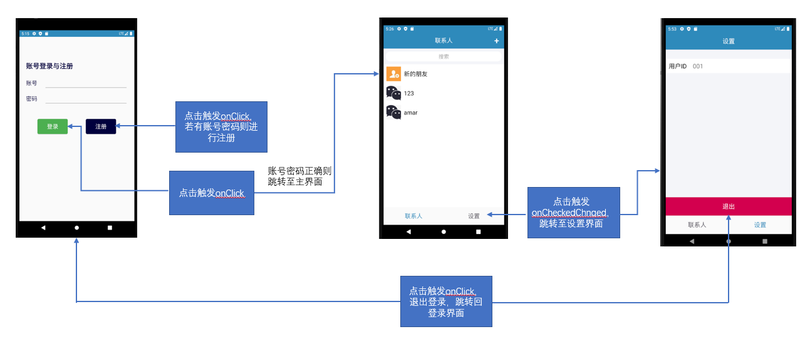
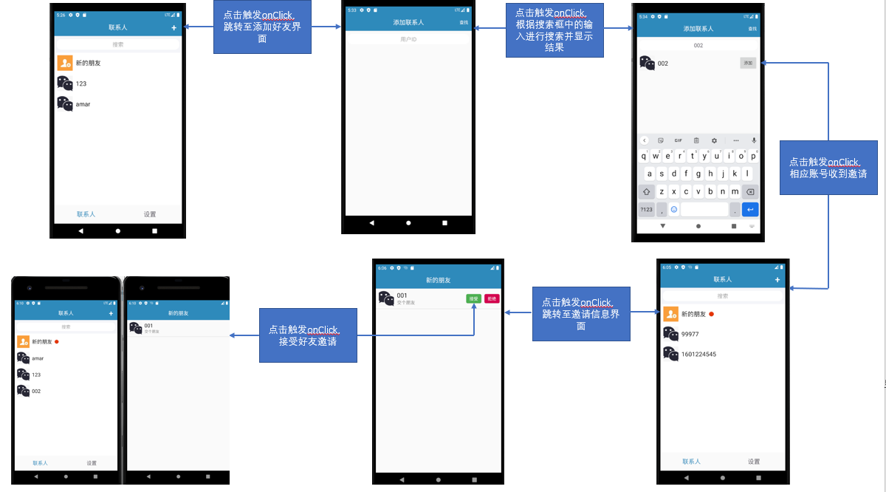
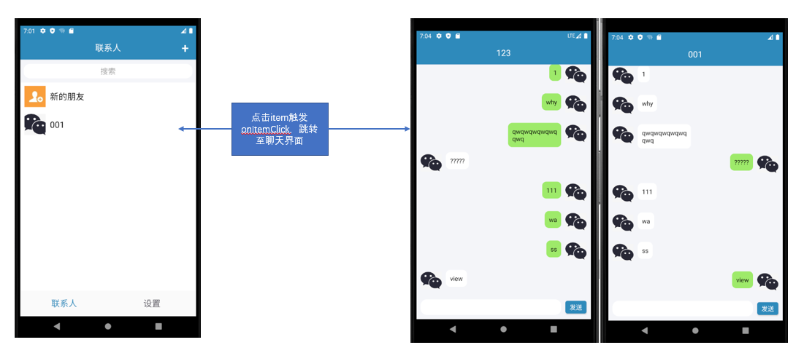

# IM聊天应用

## 成员信息

吴劢 17343118
幸赟 17343128

## 简介

制作一款使用轻松过的及时通讯软件，方便人之间的交流

## 开发环境

- **操作系统**：Windows
- **IDE**：Android Studio

## 成员分工

- **吴劢**：负责ui登录、联系人和设置界面的实现及逻辑实现，部分数据库，以及报告的撰写
- **幸赟**：负责ui设计、ppt以及部分数据库

## 重点&难点

### 1. 闪退问题

登录成功后会闪退，后来发现是AppcompatActivity默认有ActionBar，而在ui实现时隐藏了，而跳转的界面有ActionBar，将继承类改为Activity即可解决闪退问题，需要ActionBar的部分使用ToolBar替代。但实际导致闪退的原因并不清楚。

### 2. 页面刷新问题

在activity中页面刷新通过notifyDataSetChanged和runOnUiThread来实现，而fragment则需要额外的广播监听，否则无法刷新

### 3. 使用MVC模式

model部分主要有单例的模型提供线程池中的线程，管理数据库，以及存储用户和邀请信息模型等  
view部分就是各个布局文件  
controller部分则是各个页面逻辑的实现

## 功能信息

1. 实现用户的登录和注册
2. 实现联系人列表的展示
3. 实现好友添加和删除
4. 实现点击联系人进行实时会话的功能
5. 实现用户数据、邀请信息和聊天记录的存储

## 实现方法

应用执行的主要流程可用下图表示：  

1. 登录系统相关

2. 好友系统相关

3. 聊天系统相关

项目包含9个主要文件：

### SplashActivity.java

App启动的欢迎界面，存在两秒后根据登陆状态跳转至不同界面，未登录跳转至LoginActivity，登录则跳转至MainActivity

- **onCreate()**：加载ui以及初始化控件
- **onStart()**：判断当前处于登录还是未登录状态，并进行相应跳转

### LoginActivity.java

登录与注册页面代码，输入账号和密码后点击登录和注册即可完成相应操作，点击登录则会跳转到MainActivity界面

- **onCreate()**：加载ui以及初始化控件
- **signin()**：调用环信SDK的向服务器请求登录信息是否存在数据库中，并执行相应回调，将结果通过toast反馈
- **signup**：调用环信SDK向服务器的数据库与本地数据库中存储用户信息，生成用户账号，并执行相应回调，并给予用户反馈

### MainActivity.java

主页面代码。通过RadioGroup实现底部导航栏，实现两个fragment之间的跳转

- **OnCreate()**：加载ui以及注册radiogroup选中变化的监听，以此切换fragment；将联系人页面作为默认选中页面
- **switchFragment(Fragment fragment)**：将当前fragment切换为参数fragment

### ContactFragment.java

联系人页面代码。实现了邀请状态变化时红点对应的实时变化，以及长按联系人对其进行删除的操作，以及从服务器获取用户的联系人信息并将其显示在联系人列表中

- **onCreatView()**：加载ui，初始化控件和联系人适配器（ContactAdapter），并将其加载到listview中
- **onActivityCreated()**：添加右上角添加好友界面的点击监听，点击“新的朋友”的监听，和对listview的点击监听；注册广播并将listview和contextmenu进行绑定，以实现删除好友功能
- **onCreateContextMenu()**：加载contextmenu布局
- **onContextItemSelected()**：实现好友的删除功能
- **getContactsFromServer()**：从服务器获取好友列表信息
- **refresh()**：数据刷新后对页面进行刷新

### AddFriendActivity.java

联系人界面点击右上角跳转到的搜索好友并发送添加邀请的页面代码。

- **onCreate()**：加载ui，初始化控件，添加右上角查找按钮的监听和查找到用户后添加按钮的监听

### InviteActivity.java

联系人界面点击“新的朋友”后跳转到的，对邀请进行操作的页面代码

- **onCreate() && initData()**：加载ui，初始化控件，加载邀请信息的适配器（InviteAdapter），并刷新界面与注册广播接受监听
- **refresh()**：适配器信息被更新后刷新界面

### ChatActivity.java

点击联系人条目后跳转到的聊天界面代码，并implement了环信sdk中的消息监听

- **onCreate() && initData()**：加载ui，初始化控件;设置消失的适配器（ChatAdapter），并在其初始化的时候将消息记录加载进去，使其显示在listview上；注册消息接收的监听，当接收到对方发送的信息时，将其实时显示到页面上；注册了发送按钮的监听，将消息封装并发送到服务器
- **onMessageReceived()**：接收到消息后执行的操作，将其显示到页面中

### SettingFragment.java

设置界面的代码，显示当前登录用户id和退出登录功能

- **onCreateView()**：加载ui，初始化控件
- **onActivityCreated()**：注册退出登录按钮的监听，使用环信sdk对服务器进行登出处理，并执行相应回调

### Model.java

数据模型层的全局类

- **getInstance()**：获取单例
- **init()**：对该类进行初始化
- **getGlobalThreadPool()**：获取全局线程池
- **loginSuccess()**：登录成功后关闭之前的用户数据库，打开新的对应的数据库
- **getDbManager()**：获取本地数据库的管理类
- **getUserAccountDao()**：获取用户数据库的操作类

### 其他

其余的类则是对用户和邀请信息的数据库的建表类，操作类和管理类等等，以及一些工具类
